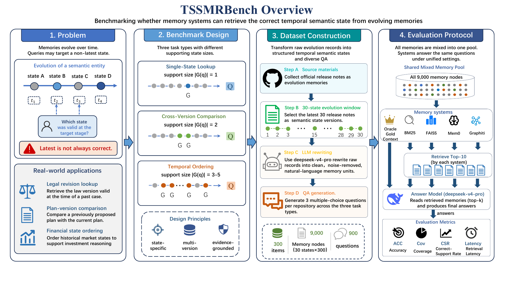
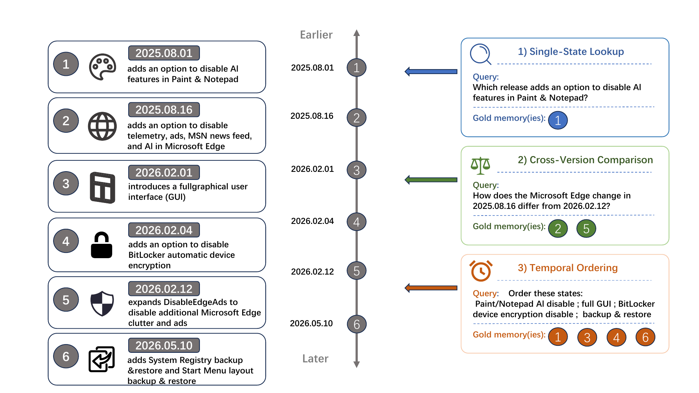
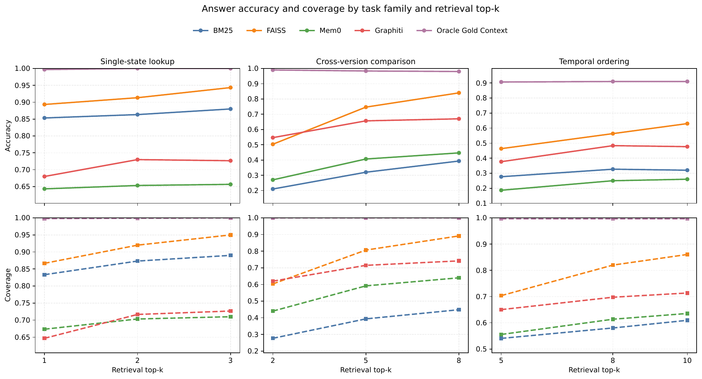

# TSSM-RBench

<p align="center">
  
</p>

## News

- The official public dataset is available on Hugging Face: <https://huggingface.co/datasets/l4st/TSSMRBench>
- This repository keeps the maintained formal release-only benchmark pipeline and paper artifacts.
- If TSSM-RBench is useful for your research, please consider giving the repository a star.

## Overview

TSSM-RBench is a benchmark for evaluating whether a memory system can retrieve the correct temporal semantic state from evolving memories. The current formal benchmark is built from 300 repository-level version-evolution scenarios and is evaluated in a single global mixed-memory pool.

The maintained pipeline in this repository covers:

- formal dataset construction;
- unified global-pool evaluation for `BM25`, `FAISS`, `Mem0`, `Graphiti`, and the oracle full-context reader;
- paper statistics and figure reproduction;
- a public redistribution package for Hugging Face.

## Task Definition

Each benchmark question targets one or more state-specific memory units from an evolving version history. The evaluated memory system must retrieve the evidence needed for a downstream answer model to identify the correct state under a temporal constraint.

TSSM-RBench contains three task families:

- `single_state_lookup`
- `cross_version_comparison`
- `temporal_version_ordering`

<p align="center">
  
</p>

## Dataset

The formal dataset lives in:

- [benchmark/data/datasets/official_300repo_release_unified_v1](benchmark/data/datasets/official_300repo_release_unified_v1)

The public release package prepared for redistribution lives in:

- [huggingface_dataset/tssmrbench_official300_public](huggingface_dataset/tssmrbench_official300_public)

### Data Statistics

- repositories: `300`
- memory units: `9000`
- questions: `900`
- task families:
  - `single_state_lookup`
  - `cross_version_comparison`
  - `temporal_version_ordering`

### Data Format

Each repository sample is stored as one unified JSON object:

```json
{
  "prototype_id": "...",
  "repo": "...",
  "window_title": "...",
  "window_summary": "...",
  "chunks": [...],
  "questions": [...]
}
```

Important fields:

- `chunks`: normalized release-derived memory units stored as `memory_unit_text`
- `questions`: benchmark questions over the repository window
- `source_chunk_ids`: gold supporting state identifiers required by each question

The public merged file is:

- `huggingface_dataset/tssmrbench_official300_public/data/official_300_merged_public.json`

The formal experiment file is:

- `benchmark/data/datasets/official_300repo_release_unified_v1/official_300_merged.json`

## Repository Structure

- [benchmark/scripts](benchmark/scripts): maintained build, evaluation, aggregation, and plotting entry points
- [benchmark/src](benchmark/src): shared benchmark logic and system adapters
- [benchmark/configs](benchmark/configs): maintained builder and evaluation configs
- [benchmark/data/datasets](benchmark/data/datasets): formal datasets
- [benchmark/data/results](benchmark/data/results): full local experiment outputs
- [benchmark/data/public_stats](benchmark/data/public_stats): aggregate-only statistics prepared for public release
- [huggingface_dataset](huggingface_dataset): public dataset package prepared for Hugging Face
- [paper](paper): paper source, generated tables, and figures
- [docs/readme_assets](docs/readme_assets): GitHub-friendly figure assets used in this README

## Installation

TSSM-RBench keeps secrets and machine-local settings separate from public configs:

- `.env.example` documents the required environment variables;
- `benchmark/configs/*.yaml` stores the reproducible experiment structure and model settings.

This separation is recommended and should be kept. Config files already resolve values from environment variables such as `${DEEPSEEK_API_KEY}` and `${SILICONFLOW_API_KEY}`.

Install the core dependencies:

```powershell
pip install -r requirements.txt
```

Install the optional memory-system dependencies when reproducing `Mem0`, `Graphiti`, and the exact FAISS setup:

```powershell
pip install -r requirements-memory.txt
```

You also need the backing services required by the maintained systems:

- Neo4j for `Graphiti`
- Qdrant for `Mem0`
- external API access for DeepSeek and SiliconFlow

## Quick Start

Build or refresh the formal dataset:

```powershell
python benchmark/scripts/78_generate_github_release_unified_formal.py
python benchmark/scripts/79_merge_github_release_unified_formal.py
```

Run one maintained system on the global mixed pool:

```powershell
python benchmark/scripts/82_run_merged_github_release_unified_global_pool_evaluation.py `
  --config benchmark/configs/state_version_experiment_config.yaml `
  --merged-json benchmark/data/datasets/official_300repo_release_unified_v1/official_300_merged.json `
  --system bm25 `
  --output-dir benchmark/data/results/official_300repo_release_unified_v1/bm25
```

## Running Baselines

Replace `--system bm25` with one of:

- `faiss`
- `mem0`
- `graphiti`
- `full_context`

To reuse the Mem0 pool with `internal_fact_k = 10`:

```powershell
python benchmark/scripts/82_run_merged_github_release_unified_global_pool_evaluation.py `
  --config benchmark/configs/state_version_experiment_config.yaml `
  --config-profile mem0_internal10 `
  --merged-json benchmark/data/datasets/official_300repo_release_unified_v1/official_300_merged.json `
  --system mem0 `
  --output-dir benchmark/data/results/official_300repo_release_unified_v1/mem0_internal10
```

## Evaluation

The final experiments use a single global mixed memory pool:

1. ingest all repository memories into one system-wide pool;
2. query the same pool for every question;
3. reuse one retrieval trace with task-specific `top-k` slicing.

### Prediction Format

Prediction records in the local result files include:

- generated answer text;
- selected option id when applicable;
- retrieved memory context;
- retrieved state matches;
- per-`k` evaluation slices.

### Metrics

Main reported metrics:

- `ACC`
- `Cov`
- `CSR`
- `Latency`

Additional aggregate analyses include task-wise breakdowns, `top-k` trends, retrieval-versus-reasoning decoupling, and context-length summaries.

## Official Results

The maintained full local experiment outputs live in:

- [benchmark/data/results/official_300repo_release_unified_v1](benchmark/data/results/official_300repo_release_unified_v1)

The aggregate-only public statistics package lives in:

- [benchmark/data/public_stats/official_300repo_release_unified_v1](benchmark/data/public_stats/official_300repo_release_unified_v1)

<p align="center">
  
</p>

## Reproducing Paper Results

Rebuild the paper statistics and figures:

```powershell
python benchmark/scripts/84_generate_official300_paper_artifacts.py
python benchmark/scripts/85_plot_official300_paper_figures.py
```

## Adding a New Method

To add a new method:

1. implement a new adapter under [benchmark/src/systems](benchmark/src/systems);
2. expose it through the shared system factory in [benchmark/scripts/68_run_state_version_evaluation.py](benchmark/scripts/68_run_state_version_evaluation.py);
3. add its configuration block to [benchmark/configs/state_version_experiment_config.yaml](benchmark/configs/state_version_experiment_config.yaml);
4. run it through the global mixed-pool evaluation script.

## Data Construction

The maintained data-construction route in this repository is the release-only formal pipeline:

1. collect versioned release materials;
2. build repository-level version-evolution windows;
3. normalize selected releases into `memory_unit_text`;
4. generate benchmark questions and merge them into the formal unified dataset.

The main entry points are:

- `benchmark/scripts/77_build_github_release_note_unified_prototype.py`
- `benchmark/scripts/78_generate_github_release_unified_formal.py`
- `benchmark/scripts/79_merge_github_release_unified_formal.py`

## Citation

If you use TSSM-RBench, please cite the paper in [paper](paper). You can also cite the Hugging Face dataset release.

## License

Please refer to the dataset package and repository license files before redistribution or derivative release.

## Contact

For questions about the benchmark, dataset, or reproduction pipeline, please open an issue in this repository.

## Acknowledgement

This repository accompanies the TSSM-RBench benchmark and its paper artifacts. Thanks for your interest and support.